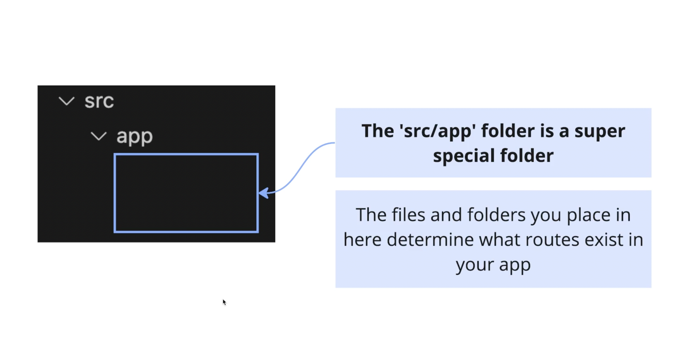
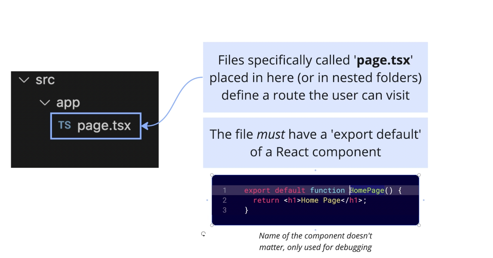
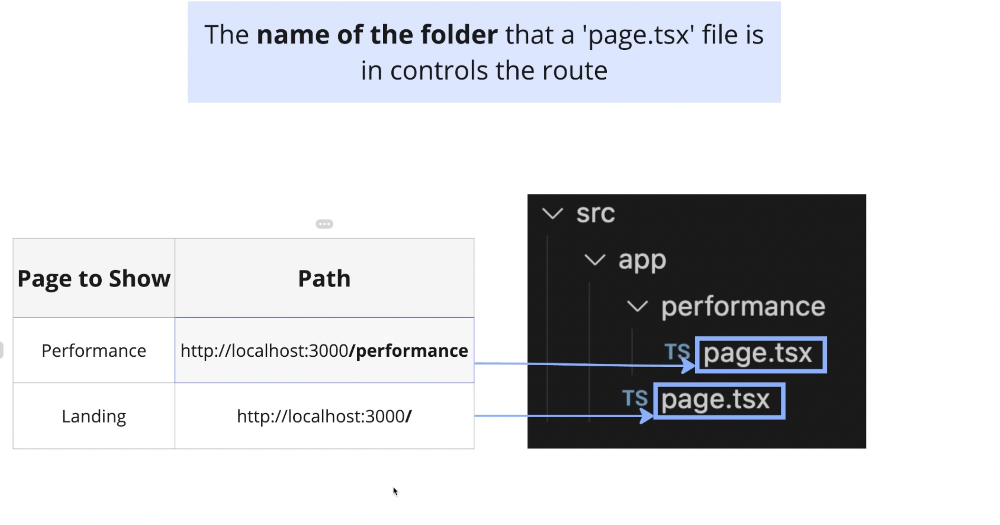
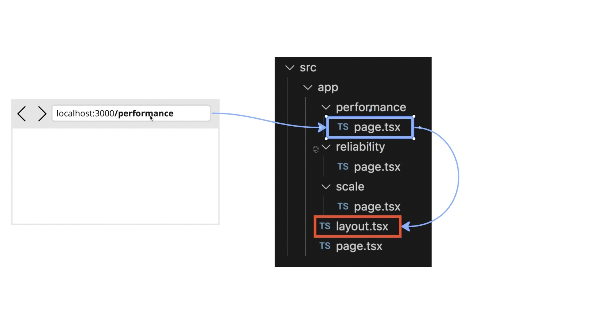
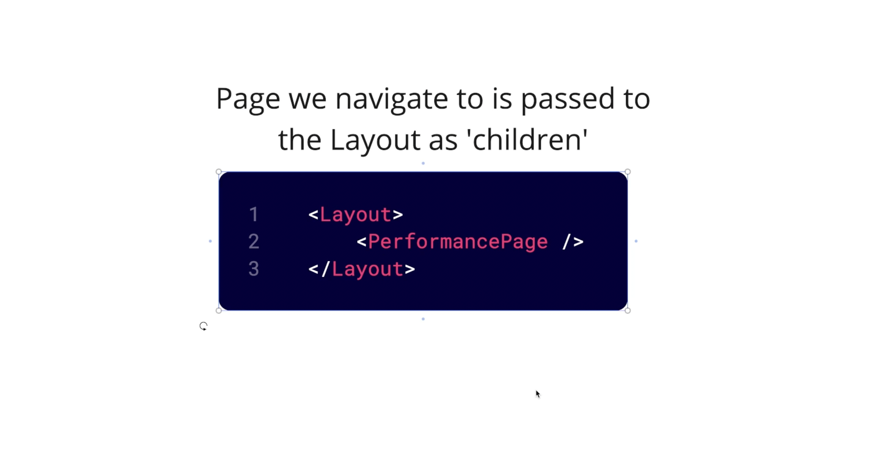

# NextJS

- [NextJS](#nextjs)
  - [File Based Routing](#file-based-routing)
  - [Link](#link)
  - [Common UI Elements](#common-ui-elements)

## File Based Routing

- The folders can be deeply nested as well to define nested routes.

## Link

- To be used in case of anchor tag.

## Common UI Elements

- When we go to a route this is actually what happens. The page.tsx file component is actually passed as a child to the layout file.
  
  
- This layout page can be used to display common ui since every element will be its child.
-
